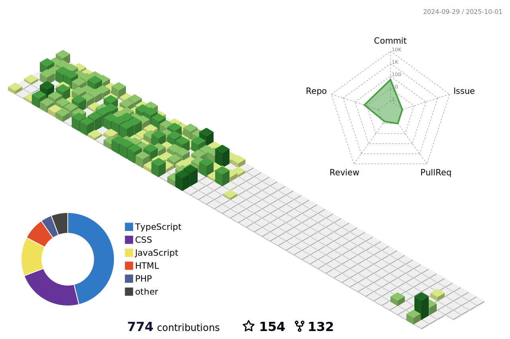

<!-- More info, tips and tricks for making GitHub Profile README can be found in my article at https://towardsdatascience.com/build-a-stunning-readme-for-your-github-profile-9b80434fe5d7 -->

# Hello, folks! 

My name is Nabeel Shar and I'm a programmer. I'm from Space, living in Mars and currently working at Blackhole. You can find me on [![Twitter][1.2]][1],  or on [![LinkedIn][3.2]][3].

## 🔧 Technologies & Tools

## &#x270d; Novel Reading

Apart from coding, I also reads Novels.

<!-- A sample of my recent articles: -->

<!-- BLOG-POST-LIST:START -->
<!-- - [Automate All the Boring Kubernetes Operations with Python](https://martinheinz.dev/blog/73)
- [End-to-End Monitoring with Grafana Cloud with Minimal Effort](https://martinheinz.dev/blog/72)
- [Goodbye, Google Analytics - Why and How You Should Leave The Platform](https://bit.ly/3JLmSgA)

- [Python f-strings Are More Powerful Than You Might Think](https://bit.ly/3uETfbi) -->
<!-- BLOG-POST-LIST:END -->

## &#x1f4c8; GitHub Stats

    

<!-- links to social media icons -->

<!-- icons with padding -->

[1.1]: http://i.imgur.com/tXSoThF.png (twitter icon with padding)
[2.1]: http://i.imgur.com/0o48UoR.png (github icon with padding)

<!-- icons without padding -->

[1.2]: http://i.imgur.com/wWzX9uB.png (twitter icon without padding)
[2.2]: http://i.imgur.com/9I6NRUm.png (github icon without padding)
[3.2]: https://raw.githubusercontent.com/MartinHeinz/MartinHeinz/master/linkedin-3-16.png (LinkedIn icon without padding)

<!-- links to your social media accounts -->

[1]: https://twitter.com/sharnabeel
[2]: https://github.com/nabeelshar
[3]: https://www.linkedin.com/in/nabeelrehman/

<!-- Resources -->
<!-- Icons: https://simpleicons.org/ -->
<!-- GitHub Stats: https://github.com/anuraghazra/github-readme-stats -->
<!-- Emojis: https://emojipedia.org/emoji/ -->
<!-- HTML Emojis: https://www.fileformat.info/index.htm -->
<!-- Shields: https://shields.io/ -->
<!-- Awesome GitHub Profile README: https://github.com/abhisheknaiidu/awesome-github-profile-readme -->
